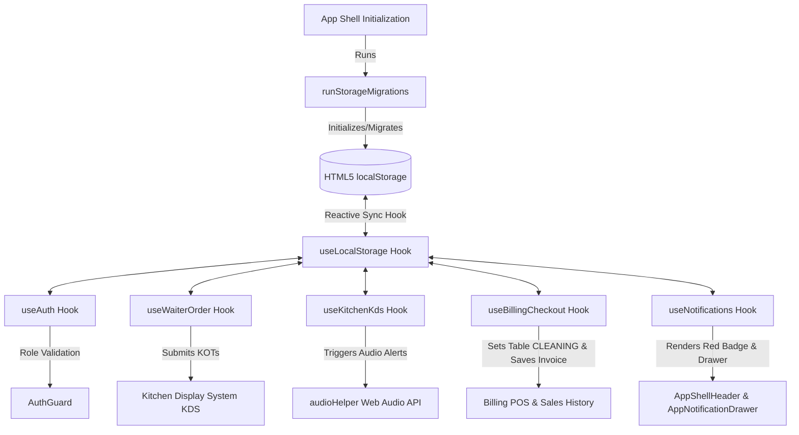

# Smart Restaurant Management System (`my-app`) — Full Technical Documentation

Welcome to the comprehensive, exhaustive technical documentation for the **Smart Restaurant Management System (`my-app`)**. This document serves as the single source of truth for developers, architects, and administrators, detailing every layer, user role, feature workflow, data model, and an exhaustive file-by-file and function-by-function scan of the entire application codebase.

---

## 📖 Table of Contents

1. [Executive Summary & Technical Architecture](#1-executive-summary--technical-architecture)
2. [User Roles & Authorization Matrix (RBAC)](#2-user-roles--authorization-matrix-rbac)
3. [Core Feature Deep-Dive & Business Logic](#3-core-feature-deep-dive--business-logic)
4. [Domain Architectural Contracts & Conventions](#4-domain-architectural-contracts--conventions)
5. [Exhaustive Codebase Directory, File & Function Scan](#5-exhaustive-codebase-directory-file--function-scan)
   - [5.1 Root Configuration & App Entry Points](#51-root-configuration--app-entry-points)
   - [5.2 Types & Data Contracts](#52-types--data-contracts)
   - [5.3 Core Libraries & Utilities](#53-core-libraries--utilities)
   - [5.4 Global Hooks & Configuration](#54-global-hooks--configuration)
   - [5.5 Shared UI & Layout Components](#55-shared-ui--layout-components)
   - [5.6 Authentication Module (`/auth`)](#56-authentication-module-auth)
   - [5.7 Admin Module (`/admin`)](#57-admin-module-admin)
   - [5.8 Waiter POS Terminal Module (`/waiter`)](#58-waiter-pos-terminal-module-waiter)
   - [5.9 Kitchen Display System (KDS) Module (`/kitchen`)](#59-kitchen-display-system-kds-module-kitchen)
   - [5.10 Cashier & Billing Terminal Module (`/billing`)](#510-cashier--billing-terminal-module-billing)
   - [5.11 Reports & Analytics Module (`/reports`)](#511-reports--analytics-module-reports)
   - [5.12 Table Reservations Module (`/reservations`)](#512-table-reservations-module-reservations)
   - [5.13 Customer Self-Service & QR Module (`/customer`)](#513-customer-self-service--qr-module-customer)
   - [5.14 Dashboard & Public Landing Module (`/dashboard`)](#514-dashboard--public-landing-module-dashboard)
6. [Data Flow & LocalStorage Schema](#6-data-flow--localstorage-schema)

---

## 1. Executive Summary & Technical Architecture

The **Smart Restaurant Management System (`my-app`)** is an enterprise-grade, multi-role Point of Sale (POS), Kitchen Display System (KDS), Customer QR Ordering, and ERP platform built for modern high-volume restaurant operations.

### Key Technology Stack

- **Framework**: [Next.js 16 (App Router)](https://nextjs.org/)
- **Core Library**: [React 19](https://react.dev/)
- **Language**: [TypeScript 5](https://www.typescriptlang.org/)
- **Styling**: [Tailwind CSS v4](https://tailwindcss.com/) with custom CSS Variables & Dark/Light Theme support
- **Icons**: [Lucide React](https://lucide.dev/)
- **Charts & Analytics**: [ApexCharts](https://apexcharts.com/) & `react-apexcharts`
- **Form Validation**: `react-hook-form`, `@hookform/resolvers`, `zod`
- **State Management & Persistence**: Reactive HTML5 `localStorage` custom hook (`useLocalStorage`) with multi-tab synchronization, automatic database seeder (`localStorageSeeder.ts`), and 0-backend dependency.
- **Migration & Transaction Engine**: `storageMigration.ts` (backward-compatible schema migrator) and `localTransaction.ts` (atomic multi-key snapshot and rollback execution).
- **Global Event Bus & Notifications**: Custom event-bus toast dispatcher (`toastService.ts`) and global notification dispatcher (`notificationService.ts`).
- **Audio Synthesizer Engine**: Custom Web Audio API synthesizer (`audioHelper.ts`) for real-time kitchen bell, void warnings, and order-ready chimes without external audio media files.

---

## 2. User Roles & Authorization Matrix (RBAC)

The application enforces strict Role-Based Access Control (RBAC) powered by the `AuthGuard` wrapper component (`src/app/auth/auth_components/AuthGuard.tsx`).

| Role | Default Route | Allowed Routes & Access Permissions | Key Responsibilities |
| :--- | :--- | :--- | :--- |
| **`ADMIN`** | `/admin` | `/admin/*`, `/waiter`, `/kitchen`, `/billing`, `/reports`, `/reservations`, `/customer`, `/dashboard` | System administration: Master Restaurant Settings, Staff creation, Credentials management, Attendance tracking, Payroll/Payslip generation, Menu & Recipe editing, Inventory stock & Supplier POs, Coupons & Promo rules, Shift auditing, Database Backup/Restore/Reset, Table QR Code Generator. |
| **`CASHIER`** | `/billing` | `/billing`, `/reservations`, `/dashboard` | Order settlement, Itemized split billing, Guest split calculations, Dynamic UPI QR generation, CRM customer loyalty points redemption, Shift register cash reconciliation, Cash Denomination Counter, Void & Discount Approval Center. |
| **`WAITER`** | `/waiter` | `/waiter`, `/reservations`, `/dashboard` | Live table occupancy grid, Ready-to-Serve pickup queue, customer service call bell drawer, taking seat-wise/course-wise KOTs, table merging & transfers, void item approval requests, table cleaning confirmation. |
| **`KITCHEN`** | `/kitchen` | `/kitchen`, `/dashboard` | Real-time Kitchen Display System (KDS), 4-tier SLA urgency timers, Consolidated Items View, multi-station filtering (Kitchen, Bar, Bakery), prep timers, status pipeline (PENDING → COOKING → READY), void alerts, recipe viewing, out-of-stock toggling, wastage logging. |
| **`CUSTOMER`** | `/customer` | `/customer`, `/dashboard` | Digital QR menu browsing, floating service request button (Water, Bill, Call Waiter, Cleaning), advance table booking, live service calls, order status tracking, feedback submission. |

---

## 3. Core Feature Deep-Dive & Business Logic

### 3.1 Table & Floor Management
- Tables are categorized into dynamic floor sections: **Dining**, **AC**, and **Outdoor**.
- Table Statuses: `AVAILABLE`, `OCCUPIED`, `BILLING_PENDING`, `CLEANING`, `RESERVED`.
- Advanced Floor Actions: Merging multiple tables for large party seating, transferring active orders seamlessly between open tables, and cleaning verification after bill settlement.

### 3.2 Menu, Recipe & Combo Engine
- Menu items support categories, multiple variants (e.g., Half/Full), kitchen station routing (Kitchen, Bar, Bakery), dietary tags (Veg 🟢, Non-Veg 🔴, Spicy 🌶️), daily special tags with expiry timers.
- Recipe mapping ties inventory ingredients to menu items with exact quantities for automated stock depletion on order placement.
- Combo engine allows grouping items at discounted prices with Happy Hour time window constraints.

### 3.3 Kitchen Display System (KDS) & Web Audio Alerts
- Orders are split into station-based KOTs (Kitchen Order Tickets).
- 4-Tier SLA Escalation Tiers:
  - 🟢 **Green**: Under SLA (< 7.5 mins)
  - 🟡 **Yellow**: Warning (7.5–10 mins)
  - 🟠 **Orange**: Time Exceeded (10–15 mins)
  - 🔴 **Red**: Severely Overdue (> 15 mins)
- Consolidated Items View (`KitchenConsolidatedItemsModal.tsx`): Aggregates total pending/cooking quantities across active KOTs (e.g. *Paneer Tikka × 8*, *Butter Naan × 14*).
- Web Audio API Sound Synthesis:
  - `playKitchenBell()`: 2-tone "ding-dong" bell when a new KOT arrives.
  - `playVoidAlert()`: 3-pulse urgent warning buzz when an item void is requested.
  - `playReadyChime()`: 3-note ascending chime when an order is marked ready.

### 3.4 Billing, Cash Denominations & Approval Center
- Multi-tax calculation: CGST (2.5%), SGST (2.5%), Service Charge (5% optional), VAT.
- Cash Denomination Counter (`BillingCashDenominationModal.tsx`): Physical cash counter across ₹500, ₹200, ₹100, ₹50, ₹20, ₹10 notes & coins computing physical cash total vs expected float.
- Void & Discount Approval Center (`BillingApprovalCenterModal.tsx`): Cashier approval interface for Waiter void requests with audit logs.
- Dynamic UPI QR Code modal generated on-the-fly with payable amount & VPA.
- CRM system: Calculates 1 loyalty point per ₹100 spent, tracks customer visit count, allows points redemption during checkout.

### 3.5 Customer Self-Service & Call Bell
- Floating Service Button (`CustomerFloatingServiceButton.tsx`): Mobile customer request button for Water, Bill, Call Waiter, Cleaning, and Short Custom Messages.
- Waiter Service Requests Queue (`WaiterServiceRequestsDrawer.tsx`): Live queue with SLA timers (Yellow at 3 min, Red at 5 min).

### 3.6 Master ERP & Promo Manager
- Master Restaurant Settings (`/admin/settings` & `AdminSettingsPage`): Form to configure Restaurant Name, Logo, Address, Phone, GSTIN, CGST/SGST/Service Charge %, UPI VPA, KDS SLA rules.
- Coupons & Discount Manager (`/admin/coupons` & `AdminCouponsPage`): Promo code builder for Flat/Percentage discounts, min order amounts, and usage limits.

---

## 4. Domain Architectural Contracts & Conventions

Every feature module under `src/app/` (`admin`, `auth`, `billing`, `customer`, `dashboard`, `kitchen`, `reports`, `reservations`, `waiter`) follows a strict 6-layer architecture:

1. `[module]_api.ts`: Centralized data access & storage operations.
2. `[module]_types.ts`: TypeScript contracts & domain models.
3. `[module]_url_config.ts`: Sub-route constants & path helpers.
4. `[module]_theme_contract.md`: Visual tokens & CSS specs.
5. `[module]_forbidden.md`: Architectural boundaries & non-goals.
6. `[Module]ErrorBoundary.tsx`: Fallback boundary wrapper.

---

## 5. Exhaustive Codebase Directory, File & Function Scan

### 5.1 Root Configuration & App Entry Points
- `src/app/layout.tsx`: Root layout providing theme wrapper, metadata, and global shell context.
- `src/app/page.tsx`: Root route redirecting users to `/dashboard`.
- `src/components/AppShell/AppShell.tsx`: Core shell mounting header, sidebar, `ToastProvider`, `CommandPaletteModal`, and `storageMigration` runner.
- `src/components/AppShell/AppShellHeader.tsx`: Header bar featuring active branch selector, search command palette trigger (`Ctrl+K`), theme toggle, profile dropdown, and live notification drawer bell.
- `src/components/AppShell/AppNotificationDrawer.tsx`: Role-filtered notification slide-over drawer with mark read, clear, and direct navigation links.
- `src/components/ui/ToastProvider.tsx`: Global floating toast notification overlay container listening on event bus.
- `src/components/ui/CommandPaletteModal.tsx`: Global search modal (`Ctrl+K`) across Tables, Menu Items, Active Orders, Sales Invoices, Customers, and Staff.
- `src/components/ui/OrderTimeline.tsx`: Visual order event timeline component showing order milestones.

### 5.2 Types & Data Contracts
- `src/types/appTypes.ts`: Master domain type definitions including `AppTable`, `AppOrder`, `AppKot`, `AppKotItem`, `KotItemStatus`, `TableStatus` (`AVAILABLE`, `OCCUPIED`, `BILLING_PENDING`, `CLEANING`, `RESERVED`), `AppServiceRequest`, `AppNotification`, `AppOrderEvent`, `AppRestaurantSettings`, `AppCoupon`, `AppAuditLog`, `AppUser`, `AppSalesRecord`, `AppCrmCustomer`, `AppShiftRegister`, `AppInventoryItem`, `AppMenuItem`.

### 5.3 Core Libraries & Utilities
- `src/lib/localStorageSeeder.ts`: Single source of truth for all 29 storage keys (`STORAGE_KEYS`) and seed data initializer (`initializeLocalStorageSeeds()`).
- `src/lib/storageMigration.ts`: Migration runner (`runStorageMigrations()`) providing backward-compatible schema updates.
- `src/lib/localTransaction.ts`: Transaction runner (`executeLocalTransaction()`) offering multi-key snapshots and automatic rollback on mutation failure.
- `src/lib/notificationService.ts`: Global notification dispatcher (`dispatchNotification()`), mark read helpers, and Web Audio trigger calls.
- `src/lib/serviceRequestService.ts`: Customer service request engine (`createServiceRequest()`) with duplicate pending check and waiter notification.
- `src/lib/orderEventService.ts`: Timeline logger (`recordOrderEvent()`, `getOrderTimelineEvents()`).
- `src/lib/toastService.ts`: Event-bus toast dispatcher (`showToast()`, `subscribeToast()`).
- `src/lib/audioHelper.ts`: Web Audio API sound synthesizer (`playKitchenBell()`, `playVoidAlert()`, `playReadyChime()`).
- `src/lib/formatters.ts`: Helper functions (`formatCurrency()`, `formatDate()`, `formatTime()`, `formatDateTime()`).

### 5.4 Global Hooks
- `src/hooks/useLocalStorage.ts`: Custom hook for reactive HTML5 `localStorage` operations with multi-tab `storage` event synchronization.
- `src/hooks/useNotifications.ts`: Custom hook for role-filtered reactive notifications.

### 5.5 Waiter POS Terminal Module (`/waiter`)
- `src/app/waiter/page.tsx`: Waiter page shell with table grid, ready-to-serve queue, and service request drawer trigger.
- `src/app/waiter/waiter_components/WaiterReadyQueue.tsx`: Queue component displaying items marked `READY` in kitchen with 1-click "Serve All" / "Serve Item".
- `src/app/waiter/waiter_components/WaiterServiceRequestsDrawer.tsx`: Drawer listing pending call bell requests with live SLA color timers.

### 5.6 Kitchen Display System Module (`/kitchen`)
- `src/app/kitchen/page.tsx`: Kitchen KDS shell with KPI bar, KOT grid, station tabs, stock toggles, and consolidated items view trigger.
- `src/app/kitchen/kitchen_components/KitchenKotCard.tsx`: Individual KOT card featuring 4-tier SLA urgency timers, ticket printing, batch start/ready actions, and void request approval buttons.
- `src/app/kitchen/kitchen_components/KitchenConsolidatedItemsModal.tsx`: Modal aggregating total pending and cooking quantities across active KOTs.

### 5.7 Cashier & Billing Module (`/billing`)
- `src/app/billing/page.tsx`: Cashier POS shell with table selector, bill summary, extra charges, discounts, CRM redemption, payment method selector, denomination counter, and approval center.
- `src/app/billing/billing_components/BillingCashDenominationModal.tsx`: Calculator for physical notes and coins with expected float variance tracking.
- `src/app/billing/billing_components/BillingApprovalCenterModal.tsx`: Approval center for Cashiers to inspect and approve/reject Waiter void requests.
- `src/app/billing/billing_hooks/useBillingCheckout.ts`: Checkout hook running inventory deduction, sales logging, CRM update, order completion, table status transition to `CLEANING`, and audit logging.

### 5.8 Admin ERP & System Module (`/admin`)
- `src/app/admin/settings/page.tsx`: Admin Master Restaurant Settings page for name, logo, address, phone, GSTIN, CGST/SGST/Service Charge %, UPI VPA, and KDS SLA thresholds.
- `src/app/admin/coupons/page.tsx`: Admin Coupon & Promo Code Manager page for creating flat/percentage discount codes and usage limits.

### 5.9 Customer Self-Service Module (`/customer`)
- `src/app/customer/page.tsx`: Mobile customer QR self-ordering page shell.
- `src/app/customer/customer_components/CustomerFloatingServiceButton.tsx`: Floating customer call bell button for Water, Bill, Waiter Call, Cleaning, and short custom notes.

---

## 6. Data Flow & LocalStorage Schema

### Complete Storage Keys & Data Models Index

1. `app_tables`: Array of `AppTable` (Floor status, section, current order ID, merged tables).
2. `app_menu`: Array of `AppMenuItem` (Menu catalog, prices, recipes, dietary tags, station routing).
3. `app_combos`: Array of `AppCombo` (Happy hour combo rules & item groupings).
4. `app_inventory`: Array of `AppInventoryItem` (Ingredient stock levels & min threshold alerts).
5. `app_orders`: Array of `AppOrder` (Active orders, KOTs, seat numbers, course holds).
6. `app_sales_history`: Array of `AppSalesRecord` (Settled invoice records & payment breakdown).
7. `app_crm_customers`: Array of `AppCrmCustomer` (Customer loyalty points & visit history).
8. `app_reservations`: Array of `AppReservation` (Table booking records).
9. `app_shift_register`: Active `AppShiftRegister` (Register opening/closing float & variance).
10. `app_audit_logs`: Array of `AppAuditLog` (Security actions, voids, checkout logs).
11. `app_users`: Array of `AppUser` (User credentials, roles, base salaries).
12. `app_salary_records`: Array of `AppSalaryRecord` (Paid monthly salary receipts).
13. `app_staff_attendance`: Array of `AppStaffAttendanceRecord` (Daily attendance records).
14. `app_wastage`: Array of `AppWastage` (Ingredient waste logs).
15. `app_feedbacks`: Array of `AppFeedback` (Customer ratings & reviews).
16. `app_notifications`: Array of `AppNotification` (Live notifications for Waiter, Kitchen, Cashier, Admin).
17. `app_service_requests`: Array of `AppServiceRequest` (Customer call bell requests with SLA tracking).
18. `app_order_events`: Array of `AppOrderEvent` (Immutable order activity timeline events).
19. `app_order_drafts`: Array of `AppOrderDraft` (Parked draft orders).
20. `app_coupons`: Array of `AppCoupon` (Promo codes and discount rules).
21. `app_restaurant_settings`: Object `AppRestaurantSettings` (Master restaurant configurations).
22. `app_customer_favorites`: Array of string item IDs (Customer favorite menu items).
23. `app_customer_recently_viewed`: Array of string item IDs (Customer recently viewed menu items).
24. `app_shift_handover_notes`: Array of handover notes (Cashier shift notes).
25. `app_refunds`: Array of refund logs (Cashier bill refund logs).
26. `app_parked_bills`: Array of parked bill drafts.
27. `app_storage_meta`: Storage version metadata (`{ version: "1.1.0" }`).
28. `app_floor_layouts`: Array of custom floor layouts.
29. `app_current_user`: Active logged-in user object.

---
*Documentation updated and verified for Smart Restaurant Management System (`my-app`).*
